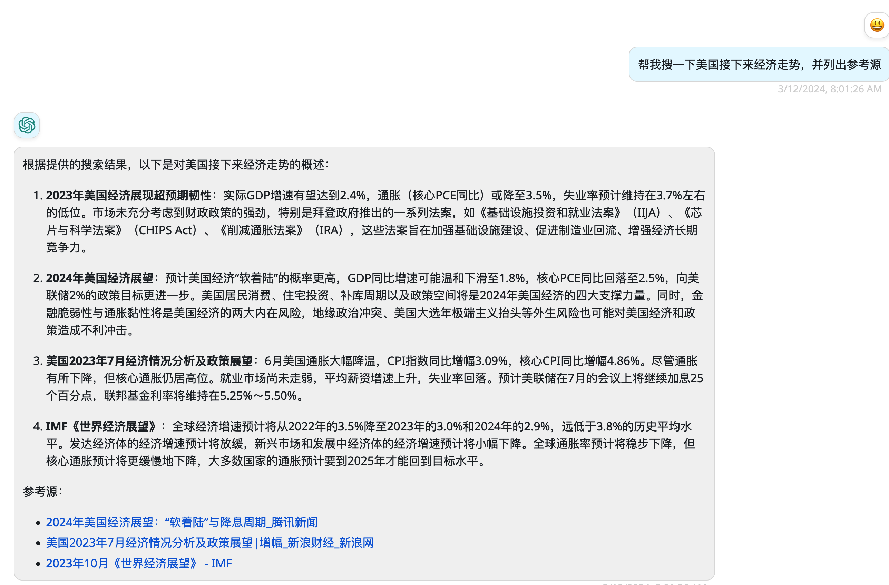
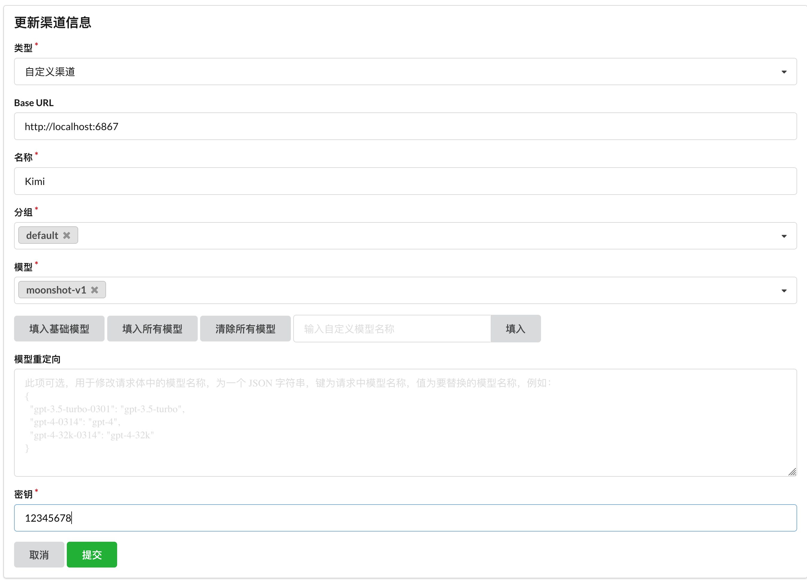

# reverse-kimi


## 目录

- [声明](#声明)
- [Features](#Features)
- [效果](#效果)
- [教程](#教程)
  - [手动部署](#手动部署)
  - [docker 部署](#docker)
  - [docker-compose](#docker-compose)
- [注意事项](#注意事项)
- [调用示例](#调用示例)

## 声明

研究 Kimi-chat 的逆向 API，仅供研究使用，禁止一切商用，若商用使用者承担一切责任。

## Features

- 生态支持广：支持加入自建 UI，比如 Chat-Next-web 和 lobe-chat，以及配合 one-api 使用
- 支持网页搜索（关键词或者网址）
- 支持文件阅读（文件链接）
- 支持多轮对话
- 本地直接部署，实现 `/v1/chat/completitions` 端点，支持**流式传输**
- 使用现代框架，Fast-API + Uvicorn，更加符合开发规范
- 支持 docker 部署
- 支持 OAuth 认证
- 极简实现，方便二次开发

## 效果

1. 验证是否是 Kimi
   
2. Kimi 自带的浏览功能
   
   
3. Kimi 自带的文件阅读功能
   
4. Kimi 多轮对话
   

## 教程

### 获取变量

登录 [Kimi 官网](https://kimi.moonshot.cn/chat/)，打开一个聊天界面，等个十分钟左右，打开浏览器调试界面[F12]，然后刷新，寻找 access_token 和 refresh_token


---

无论用下面何种部署方式，模型的名字是`moonshot-v1`，也就是你需要填入 UI 中的

### 手动部署

- 首先按照 requirements.txt 安装好依赖
- 根目录创建`config.json`，填入我们刚刚抓取的变量，token 为你个人的 key（这里并非是什么官方，自己设置即可），如果不填会返回未认证错误，可以理解为 openai 的 api key，这里**不要加 Bearer**
  ```json
  {
    "token": "12345678", // 举个例子
    "auth_token": "Bearer ...",
    "refresh_token": "Bearer ..."
  }
  ```
- 再开两个终端，一个负责刷新，一个负责接受请求
  ```bash
  # 终端一
  python main.py
  --------
  # 终端二
  python server.py
  ```

### docker

docker 部署时，当前目录创建`config.json`，填入我们刚刚抓取的变量，如果是`docker-compose.yml`，就跟它同级目录创建

```json
{
  "token": "12345678",
  "auth_token": "Bearer ...",
  "refresh_token": "Bearer ..."
}
```

```
docker run --name reverse-kimi \
    --restart always \
    -p 6867:6867 \
    -v $(pwd)/config.json:/app/config.json \
    -e TZ=Asia/Shanghai \
    yunpengtai/reverse-kimi:latest
```

### docker-compose

```
version: '3'

services:
  reverse-kimi:
    container_name: reverse-kimi
    image: yunpengtai/reverse-kimi:latest
    restart: always
    ports:
      - "6867:6867"
    volumes:
      - ./config.json:/app/config.json
    environment:
      - TZ=Asia/Shanghai
```

都运行起来之后，默认的端口在 `6867`（可以在 server.py 里面进行修改），可以像访问 openai 的 api 一样访问，`http://localhost:6867/v1/chat/completitions`

## 注意事项

提交时只能包含下列项，若有未出现的，则会报错，其中 messages 是必须项，也可以查看`http://localhost:6867/docs`查看文档

```json
{
    "messages": list
    "model": str
    "stream": bool
    "temperature": float
    "presence_penalty": float
    "frequency_penalty": float
    "top_p": int
    "max_tokens": int
}
```

## 调用示例

### one-api 示例

对于所有自建 UI，都可以使用 one-api 集成，然后进行对接



### Python 调用

```python
url = "http://127.0.0.1:6867/v1/chat/completions"
prompt = [{'content': '天空为什么不是红色', 'role': 'user'}]

payload = {
    "model": "moonshot-v1",
    "messages": [{"role": "user", "content": prompt}],
}
headers = {
    "Authorization": "Bearer 12345678"
}
response = requests.request("POST", url, headers=headers, json=payload)

for chunk in response.iter_lines(chunk_size=1024):
    print(chunk)
```

### 可能的问题

chat-next-web 会额外调用 Options 路由，可以使用 one-api 集成然后使用