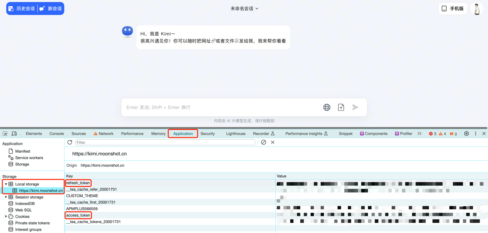

# reverse-kimi

## 声明

研究 Kimi-chat 的逆向 API，仅供研究使用，禁止一切商用，若商用使用者承担一切责任。

## Features

- 逆向了月之暗面公司的 Kimi-chat，通过模拟网页端交互来免费调用 API，可以将其加入一些自建 UI，比如 Chat-Next-web 和 lobe-chat
- 本地直接部署，实现 `/v1/chat/completitions` 端点，支持**流式传输**
- 使用现代框架，Fast-API + Uvicorn，更加符合开发规范
- 极简实现，方便二次开发

## 效果

1. 验证是否是 Kimi

2. Kimi 自带的浏览功能

3. Kimi 自带的文件阅读功能


## 教程

- 首先按照 requirements.txt 安装好依赖
- 接着登录 [Kimi官网](https://kimi.moonshot.cn/chat/)，打开一个聊天界面，等个十分钟左右，打开浏览器调试界面[F12]，然后刷新，寻找 access_token 和 refresh_token
，有了这两个之后，根目录下创建`tokens.json`，填入以下：
    ```json
    {
        "auth_token": "Bearer ...",
        "refresh_token": "Bearer ..."
    }
    ```
- 获取你当前的会话 id，就是你网址后面那一串，比如`https://kimi.moonshot.cn/chat/cnhsul9kqq4ohv5hbni0`就是`cnhsul9kqq4ohv5hbni0`，然后将其替换掉 main 里的 `CHAT_ID`
- 接着开两个终端，一个负责刷新，一个负责接受请求
    ```bash
    # 终端一
    python main.py
    --------
    # 终端二
    python server.py
    ```