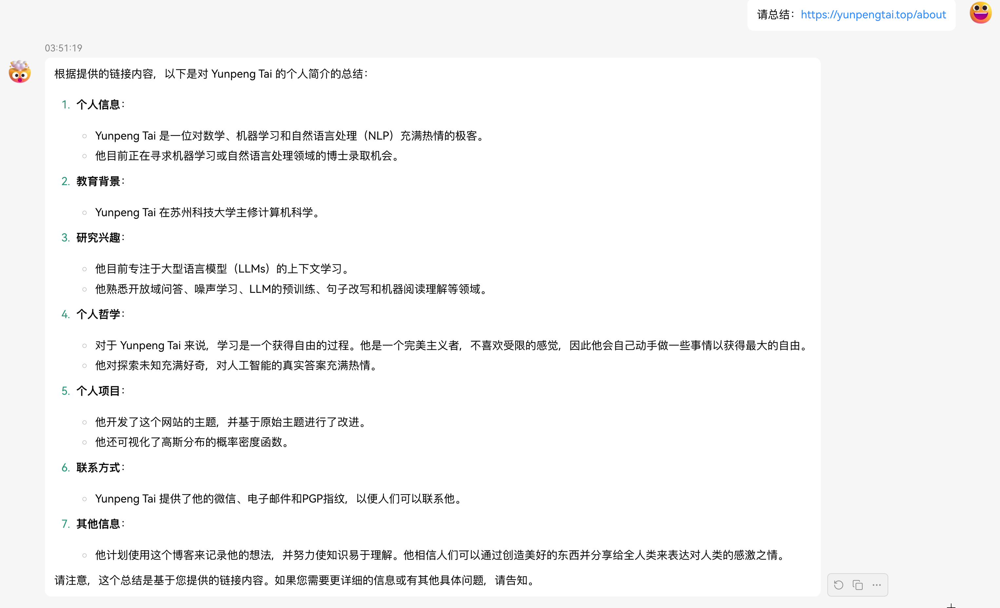
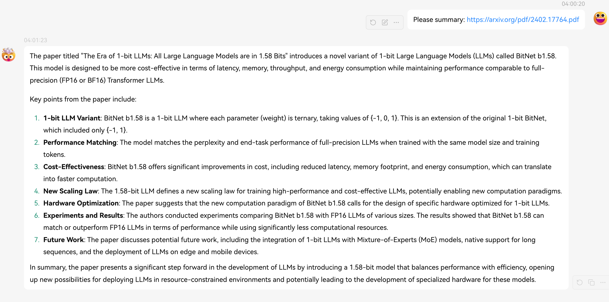

# reverse-kimi


## 目录

* [声明](#声明)
* [Features](#Features)
* [效果](#效果)
* [教程](#教程)
  * [手动部署](#手动部署)
  * [docker 部署](#docker)
  * [docker-compose](#docker-compose)
* [注意事项](#注意事项)

## 声明

研究 Kimi-chat 的逆向 API，仅供研究使用，禁止一切商用，若商用使用者承担一切责任。

## Features

- 逆向了月之暗面公司的 Kimi-chat，通过模拟网页端交互来免费调用 API，可以将其加入一些自建 UI，比如 Chat-Next-web 和 lobe-chat
- 本地直接部署，实现 `/v1/chat/completitions` 端点，支持**流式传输**
- 使用现代框架，Fast-API + Uvicorn，更加符合开发规范
- 支持 docker 部署
- 支持 OAuth 认证
- 极简实现，方便二次开发

## 效果

1. 验证是否是 Kimi

2. Kimi 自带的浏览功能

3. Kimi 自带的文件阅读功能


## 教程

### 获取变量

登录 [Kimi官网](https://kimi.moonshot.cn/chat/)，打开一个聊天界面，等个十分钟左右，打开浏览器调试界面[F12]，然后刷新，寻找 access_token 和 refresh_token


### 手动部署

- 首先按照 requirements.txt 安装好依赖
- 根目录创建`config.json`，填入我们刚刚抓取的变量，token 为你的 key，如果不填会返回未认证错误，可以理解为 openai 的 api key
    ```json
    {
        "token": "Bearer ...",
        "auth_token": "Bearer ...",
        "refresh_token": "Bearer ..."
    }
    ```
- 再开两个终端，一个负责刷新，一个负责接受请求
    ```bash
    # 终端一
    python main.py
    --------
    # 终端二
    python server.py
    ```

### docker

docker 部署时，当前目录创建`config.json`，填入我们刚刚抓取的变量，如果是`docker-compose.yml`，就跟它同级目录创建

```json
{
    "token": "Bearer ...",
    "auth_token": "Bearer ...",
    "refresh_token": "Bearer ..."
}
```

```
docker run --name reverse-kimi \
    --restart always \
    -p 6867:6867 \
    -v $(pwd)/config.json:/app/config.json \
    -e TZ=Asia/Shanghai \
    yunpengtai/reverse-kimi:latest
```

### docker-compose
```
version: '3'

services:
  reverse-kimi:
    container_name: reverse-kimi
    image: yunpengtai/reverse-kimi:latest
    restart: always
    ports:
      - "6867:6867"
    volumes:
      - ./config.json:/app/config.json
    environment:
      - TZ=Asia/Shanghai
```

都运行起来之后，默认的端口在 `6867`（可以在 server.py 里面进行修改），可以像访问 openai 的 api 一样访问，`http://localhost:6867/v1/chat/completitions`

## 注意事项

提交时只能包含下列项，若有未出现的，则会报错，其中 messages 是必须项，也可以查看`http://localhost:6867/docs`查看文档

```json
{
    "messages": list
    "model": str
    "stream": bool
    "temperature": float
    "presence_penalty": float
    "frequency_penalty": float
    "top_p": int
    "max_tokens": int
}
```